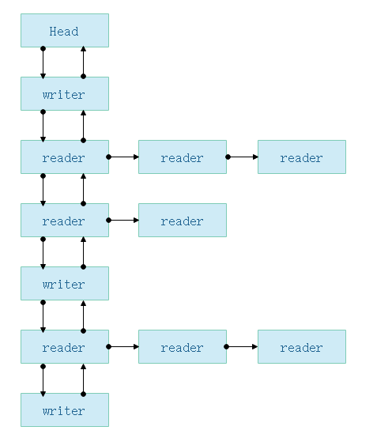

# ReadWriteLock

使用C#实现的`可重入`、`非公平`的`读写锁`，主要目的实现**并发读写**以及**读写同步**问题。为了**减少读等待时间**以及**防止出现写饥饿现象**，本锁使用了**非同步锁**的实现，允许**读优先（提高效率）**的同时**使用一个阈值限定读者的最大数量（防止写饥饿）**；重入机制允许某个线程可以获取锁多次（如多次函数调用导致的锁重入），每次获取都需要有对应的释放，否则会出错。

本锁的目的是实现对读写线程队列的调度，而不是对线程获取锁的顺序进行调度。要注意读写线程进入队列的顺序是系统调度的（意即创建多个线程并Start时，其进入线程的时机是系统决定的，可能最后创建的线程最先执行），这里实现的是**对进入队列后的线程进行阻塞、唤醒等操作**。

本锁使用了`C#`中的`lock原语`，目的是为了实现一些**队列操作的原子性**。

## Node节点

Node节点是实现本读写锁的关键所在，读写线程队列也是基于Node节点实现的。Node内部持有了一个线程，同时有很多指向其他Node的引用。Node类实现如下：

```c#
public class Node
    {
        // 读节点
        public static readonly Node SHARED = new Node();
        // 写节点
        public static readonly Node EXCLUSIVE = null;
        // 读链长度阈值
        public static int Threshold = 3;

        // 节点状态
        public static readonly int CANCELLED = 1;
        public static readonly int RUNNING = -1;
        public static readonly int WAITING = -2;
        public static readonly int SIGNAL = -3;
    
        public int waitStatus;
        // 前驱节点
        public Node prev;
        // 后继节点
        public Node next;
        // 持有线程
        public Thread thread;

        //以下参数仅对读节点适用
        // 读链头
        public Node readerHead;
        // 后继读节点
        public Node nextReader;
        // 读链长度
        public int readerCount = 1;

        // 节点类型
        public Node mode;
        // 是否是共享节点
        public bool isShared()
        {
            return mode == SHARED;
        }
        public Node()
        {
        }

        // 创建共享或独占节点
        public Node(Thread thread, Node mode)
        {
            this.mode = mode;
            this.thread = thread;
        }
    
    	// 获取状态
        public static string GetStatus(int status)
        {
            switch (status)
            {
                case 1:
                    return "CANCELLED";
                case -1:
                    return "RUNNING";
                case -2:
                    return "WAITING";
                case -3:
                    return "SIGNAL";
            }
            return "DEFAULT";
        }
    }
```

各属性及方法的涵义如上述代码注释所示，而由Node组成的等待队列结构（双向链表）如下图所示（可能出现的一种情况）：



对于写节点来说，锁是独占的，一次仅能有一个写线程在执行；而对于读节点来说，锁是共享的，在同一读链上的所有节点都可同时进行读。

## 重要变量

### 头节点 head

头节点是个傀儡节点，`private volatile Node head`，其无实际涵义，只是为了作为队列头而存在；其使用了惰性初始化的方法，仅在第一个节点入队列时初始化。

> `volatile`关键字在是为了实现变量的内存可见性，使用该关键字修饰的变量的修改会直接反映到内存中而不是缓存中。

### 尾节点 tail

尾节点是队列的最后一个节点，`private volatile Node tail`，引入尾节点是为了防止在新节点入列时遍历队列，提高了效率。

### 重入量 reentrants

对于写锁（独占锁）来说，当一个写线程获取锁时，`reentrants`为`1`，后续每当锁重入一次，`reentrants`增加`1`；释放锁时，每释放一次`reentrants`减少1，直到`reentrants`为`0`时该线程释放当前锁，唤醒后续线程；

对于读锁（共享锁）来说，由于读链中可能会有不超过`Node.Threshold`个数的读节点，且每个读节点都可能会产生重入，这里会将`reentrants`初始化为读链长度，在`Node.RUNNING``时读链每增加一个读节点会增加一个reentrants`，读链中的每个节点多一次重入也会导致`reentrants`增加`1`。

## 写锁

### 获取 WriteLock()

先看获取写锁的流程：

```c#
/**
 * 获取写锁
 */
public void WriteLock()
{
    // 当前节点
    Node currentNode = null;
    // 这里使用了惰性初始化，如果头节点为空，则初始化头节点
    lock (this)
    {
        if (head == null)
            head = new Node();
    }
    // 如果尾节点为空，说明当前队列为空，此时线程直接入队列设置为RUNNING状态
    lock (this)
    {
        if (tail == null)
        {
            EnqWhenTailNull(Node.EXCLUSIVE);
            return;
        }
    }
    lock (this)
    {
        // 如果当前线程就是持有线程，说明锁在重入，reentrants加1
        if (owner == Thread.CurrentThread)
        {
            reentrants += 1;
            return;
        }
        // 否则，当前线程需要进入等待队列进行等待
        else
        {
            // 获取尾节点
            Node t = tail;
            // 由于可能出现其他线程的介入，需要再次检测为节点是否为空
            if (t == null)
            {
                EnqWhenTailNull(Node.EXCLUSIVE);
                return;
            }
            // 否则直接入队列等待
            else
                currentNode = Enq(Node.EXCLUSIVE);
        }
    }
    // 检测当前节点是否可以被唤醒
    while (currentNode.waitStatus != Node.SIGNAL) { }
    // 此时线程已被唤醒，设置重入量及状态等
    reentrants = 1;
    currentNode.waitStatus = Node.RUNNING;
    owner = Thread.CurrentThread;
}
```

基本流程如下：

1. 先判断队列是否已初始化，若未初始化，先初始化head节点
2. 判断队列是否为空（即判断`tail==null`），若是直接进入队列，成功获取锁，返回；否则进入下一步
3. 判断当前线程是否为持有锁的线程，若是说明线程在重入当前锁，直接`reentrants`加`1`，成功获取锁，返回；否则进入下一步
4. 获取尾节点，由于第2步结束时可能有其他线程的介入，因此需再次判断`tail==null`，若是直接进入队列，成功获取锁，返回；否则以当前线程创建节点并入队列，同时阻塞
5. 循环检测当前节点是否可以被唤醒，若可则解除阻塞状态，设置节点状态等信息，并成功获取独占锁

### 释放 WriteUnlock()

释放写锁的逻辑很简单：

```c#
/**
 * 释放写锁
 */
public void WriteUnlock()
{
    // 加锁是为了同步修改队列信息
    lock (this)
    {
        // 当前锁持有者重入量直接-1
        reentrants -= 1;
        // 获取队列头（除了head之外的头）
        Node node = GetHolderNode();
        // 如果后续节点为空，则释放完成，队列已空；若后续节点不为空，则可能需要唤醒后续节点
        if (node != null)
        {
            // 若当前锁的重入量为0，说明锁已经完全释放，则需要唤醒后继有效节点（否则可能只是释放了一个锁内部的锁）
            if (reentrants == 0)
            {
                // 当前节点置为无效
                node.waitStatus = Node.CANCELLED;
                // 唤醒后继有效节点
                AwakeNext();
            }
        }
    }
}
```

逻辑如下：

1. 锁`reentrants`减`1`
2. 获取当前锁持有的节点
3. 判断上述获取的节点是否为空，若为空说明队列已空，已无等待节点，直接返回；否则检查`reentrants`是否已减至`0`
4. 若是则当前节点线程已完成，置为`Node.CANCELLED`状态，并唤醒后继有效节点

## 读锁

### 获取 ReadLock()

相比于写锁的获取，读锁的获取要复杂一点，因为涉及到读的共享以及阈值的控制：

```c#
/**
 * 获取读锁
 */
public void ReadLock()
{
    Node reader = null;
    // 这里基本的初始化方式和读锁相似，不赘述
    lock (this)
    {
        if (head == null)
            head = new Node();
    }
    Thread current = Thread.CurrentThread;
    lock (this)
    {
        if (tail == null)
        {
            EnqWhenTailNull(Node.SHARED);
            return;
        }
    }
    Node currentNode = null;
    lock (this)
    {
        // 读可重入
        if (ReaderCanReentranted())
        {
            reentrants += 1;
            return;
        }
        // 获取当前持有锁节点
        Node node = head.next;
        if (node == null)
        {
            EnqWhenTailNull(Node.SHARED);
            return;
        }
        else
        {
            // 队列中有写者的情况
            if (HasWriter())
            {
                // 创建当前持有当前线程的读节点
                reader = new Node(current, Node.SHARED);
                // 获取第一个读节点（可能为null）
                while (node != null && (!node.isShared() || node.waitStatus == Node.CANCELLED))
                {
                    if (node.isShared())
                    {
                        if (!CheckReadChainCancelled(node))
                            break;
                        else
                            node = node.next;
                    }
                    else
                        node = node.next;
                }
                // 未找到读节点，说明队列中只有写节点，此时直接添加到队列尾
                if (node == null)
                {
                    currentNode = Enq(Node.SHARED);
                }
                // 否则说明找到了有效的读节点，此时此读节点为队列中第一个读节点，只需要判断此读节点链长是否达到了阈值，
                //  若未超过阈值，直接添加到读链中，并判断当前读链头是否正在读，则可以直接读，否则需要循环检测；
                //  若超过了阈值：
                //      若队尾为写节点，则添加到队列尾，并循环等待；
                //      若队尾为读节点，判断是否到达阈值：
                //          若是则添加到队列尾，并循环等待；
                //          否则添加到读链中。
                else
                {
                    // 未超过阈值
                    if (node.readerCount < Node.Threshold)
                    {
                        // 添加到读链中
                        currentNode = AddReader(node, reader);
                        // 链头正在读，此节点也直接读，且reentrants+1
                        if (node.waitStatus == Node.RUNNING)
                        {
                            reader.waitStatus = Node.RUNNING;
                            reentrants += 1;
                            return;
                        }
                    }
                    // 超过了阈值
                    else
                    {
                        // 判断队尾节点类型
                        Node t = tail;
                        // 队尾为“写节点”或“达到阈值的读节点”
                        if (!t.isShared() || (t.isShared() && t.readerCount >= Node.Threshold))
                            currentNode = Enq(Node.SHARED);
                        // 队尾为“未达到阈值的读节点”
                        else
                        {
                            // 添加到队尾节点所在的读链中
                            currentNode = AddReader(t, reader);
                            // 链头正在读，此节点也直接读，且reentrants+1
                            if (t.waitStatus == Node.RUNNING)
                            {
                                reader.waitStatus = Node.RUNNING;
                                reentrants += 1;
                                return;
                            }
                        }
                    }
                }
            }
            // 队列中无写者，说明队列中要么为空，要么全为读者，直接加到队尾或者队尾所在的读链
            else
            {
                // 队列为空，直接入队
                if (tail == null)
                {
                    EnqWhenTailNull(Node.SHARED);
                    return;
                }
                // 队尾节点读链长度未达到阈值
                if (tail.readerCount < Node.Threshold)
                {
                    reader = new Node(current, Node.SHARED);
                    // 添加到链尾
                    currentNode = AddReader(tail, reader);
                    // 是否需要循环等待
                    if (tail.waitStatus == Node.RUNNING)
                    {
                        reader.waitStatus = Node.RUNNING;
                        reentrants += 1;
                        return;
                    }
                }
                // 队尾节点读链达到了阈值，直接加入队尾，并等待唤醒
                else
                {
                    currentNode = Enq(Node.SHARED);
                }
            }
        }
    }
    while (currentNode.waitStatus != Node.SIGNAL) { }
    currentNode.waitStatus = Node.RUNNING;
    reentrants = currentNode.readerHead.readerCount;
    owner = currentNode.readerHead == null ? null : currentNode.readerHead.thread;
}
```

逻辑如下：

1. 先判断队列是否已初始化，若未初始化，先初始化head节点
2. 判断队列是否为空（即判断`tail==null`），若是直接进入队列，成功获取锁，返回；否则进入下一步
3. 判断当前线程是否可重入锁（读线程的可重入判断与写不同，会在后面对`ReaderCanReentranted()`方法解释时介绍到），若是`reentrants`加`1`，返回；否则进入下一步
4. 获取当前持有锁节点，若为空说明队列为空，直接进入队列，成功获取锁，返回；否则进入下一步
5. 判断队列中是否有写者，若是跳至第6步，否则跳至第7步
6. 队列中有写者，为防止出现写饥饿的情况，此读节点可能在写者前或后：
   1. 若队列中无读节点，即只有写节点，直接添加至队列尾，并阻塞
   2. 若找到了队列中的第一个有效读节点，判断其读链是否达到阈值
   3. 若未超过阈值，则直接添加到读链中，是否阻塞由读链头的状态决定
   4. 若超过了阈值，则有两种情况：
      - 队尾为**写节点**或者队尾为**读节点且读链长度达到阈值**，此时节点添加至队列尾，并阻塞
      - 队尾为**读节点且读链长度未达到阈值**，将节点加入队尾的读链中，与队尾节点状态一致
7. 队列中无写者，说明队列中要么为空，要么全为读者，则根据队尾节点读链长度来决定是直接加到队尾还是加到队尾所在的读链
8. 循环检测当前节点是否可以被唤醒，若可则解除阻塞状态，设置节点状态等信息，设置`reentrants`为读链长度，并成功获取共享锁

### 释放 ReadUnlock()

```c#
/**
 * 释放读锁
 */
public void ReadUnlock()
{
    lock (this)
    {
        // 读重入量-1
        reentrants -= 1;
        // 获取到锁持有节点
        Node node = head.next;
        while (node != null)
        {
            if (CheckReadChainCancelled(node))
            {
                node = node.next;
                head.next = node;
                if (node != null)
                    node.prev = head;
            }
            else
                break;
        }
        // 获取到有效读节点了
        if (node != null)
        {
            // 通过一个读节点（通常是链头）获取其读链中持有当前运行线程的节点
            node = GetCurrentNodeByReader(node);
            // 当前节点置为取消
            node.waitStatus = Node.CANCELLED;
            // 重入量为0，需要判断读链是否已全部读完成，若是则需要唤醒后续线程
            if (reentrants == 0)
                AwakeNext();
        }
    }
}
```

释放读锁的逻辑与释放写锁逻辑基本类似，无需多提。

## 其余辅助方法

### Enq(Node mode)

以当前线程为基础，指定类型创建节点，并入队列并阻塞，同时返回此节点

```c#
/**
 * 读写节点入队列操作，入队列后需等待
 */
private Node Enq(Node mode)
{
    Node t = tail;
    // 以当前线程创建独占节点
    Node node = new Node(Thread.CurrentThread, mode);
    // 连接尾节点与当前节点
    t.next = node;
    node.prev = t;
    // 重置尾节点为当前节点
    tail = node;
    // 设置节点等待状态为WAITING
    node.waitStatus = Node.WAITING;
    // 若为读节点，需要设置读链头
    if (node.isShared())
        node.readerHead = node;
    return node;
}
```

### EnqWhenTailNull(Node mode)

以当前线程为基础，指定类型创建节点，在队列为空时，此节点直接入队列且当前线程继续执行

```c#
/**
 * 读写节点入队列操作，此时队列尾为空，入队列之后继续运行，无需等待
 */
private void EnqWhenTailNull(Node mode)
{
    // 以当前线程创建独占节点
    Node node = new Node(Thread.CurrentThread, mode);
    // 设置等待类型为RUNNING
    node.waitStatus = Node.RUNNING;
    // 当前节点加入队列，尾节点为当前节点
    tail = node;
    // 设置锁的持有者为当前线程
    owner = Thread.CurrentThread;
    // 重入量初始为1
    reentrants = 1;
    // 连接头节点与此节点
    head.next = node;
    node.prev = head;
    // 若为读节点，需要设置读链头
    if (node.isShared())
        node.readerHead = node;
}
```

### AwakeNext()

当某个节点置为`Node.CANCELLED`状态时，会唤醒其后一个有效节点，主要是将节点状态修改为`Node.SIGNAL`状态，以被各自节点监测到。

对于写节点来说，由于是独占的，只需要修改该节点；对于读节点来说，由于是共享的，需要遍历该节点所在的读链并修改每个节点的状态，才能达到唤醒整条读链的目的。

```c#
/**
 * 唤醒后一个节点
 */
private void AwakeNext()
{
    // 获取持有当前锁的节点，此时锁刚好被上个节点释放，获取的节点应处于Node.WAITING状态
    Node node = GetHolderNode();
    // 当前节点为空，说明队列中无有效节点，直接返回即可
    if (node == null)
    {
        tail = null;
        owner = null;
        reentrants = 0;
        return;
    }
    // 否则需要唤醒此有效节点
    else
    {
        // 连接到头节点
        node.prev = head;
        // 对于写节点，readerCount为1，即为reentrants初始值1
        // 对于读节点，readerCount即为reentrants的初始值
        reentrants = node.readerCount;
        // 对于读节点来说，需唤醒读链中的所有节点；对于写节点来说，无读链，只会唤醒当前节点
        while (node != null)
        {
            // 等待类型设置为SIGNAL，会被捕捉从而唤醒相关线程
            node.waitStatus = Node.SIGNAL;
            // 若为读节点，可获取下一个读者；否则获取了null
            node = node.nextReader;
            // 下一个读者不为空，则也将其前驱节点设置为头节点
            if (node != null)
                node.prev = head;
        }
    }
}
```

### GetHolderNode()

```c#
/** 
 *   删除无效节点（可能由于主动中断或者其他因素导致的线程失效），获取第一个有效节点或空节点，
 * 或者称作获取锁持有节点
 */
private Node GetHolderNode()
{
    Node node = head.next;
    // 此循环的判断条件可能出现歧义，因存在读链头为取消状态时，读链中仍然有读节点读未完成，但是此函数只在释放写锁(WriteUnlock)和唤醒后续节点(AwakeNext)中使用到，当AwakeNext被触发时，读链头的状态便可以代表整个读链的状态了。
    while (node != null && node.waitStatus == Node.CANCELLED)
        node = node.next;
    // 连接头节点和持有节点，无效节点全部交由垃圾收集器回收
    head.next = node;
    if (node != null)
        node.prev = head;
    return node;
}
```

### HasWriter()

在读节点获取锁时，有一步是需要判断队列中是否存在写者，即用到此函数

```c#
/**
 * 返回当前队列中是否存在写者，用在读者入队列时的决策
 */
private bool HasWriter()
{
    bool exclusive = false;
    Node excluNode = head.next;
    while (excluNode != null)
    {
        if (!excluNode.isShared())
        {
            exclusive = true;
            break;
        }
        excluNode = excluNode.next;
    }
    return exclusive;
}
```

### GetCurrentNodeByReader(Node node)

在释放读锁时，我们无法直接获取到当前节点，只能通过线程名称来确定当前线程的持有者在`node`所在的读链中的位置，返回获取到的节点，以在释放锁时修改状态。

而由于是通过线程名称来判断线程是否相等，可能会因线程重名导致异常，待改进。

```c#
/**
 * 通过一个读节点（通常是链头）获取其读链中持有当前运行线程的节点
 */
private Node GetCurrentNodeByReader(Node node)
{
    Node nextReader = node.readerHead;
    // 以线程名称为依据，这里可能出现多个线程同名的情况，待改进
    while (nextReader != null)
    {
        if (nextReader.thread.Name.Equals(Thread.CurrentThread.Name))
            return nextReader;
        else
            nextReader = nextReader.nextReader;
    }
    return null;
}
```

### CheckReadChainCancelled(Node node)

对于写节点来说，只要节点状态为`Node.CANCELLED`，说明写已经完成；而对于读节点，需要遍历读链中所有节点的状态才能确定读是否完成，此方法便是如此。

```c#
/**
 * 通过一个读节点判断其所在读链是否已全部读完成
 */
private bool CheckReadChainCancelled(Node node)
{
    Node nextReader = node.readerHead;
    while (nextReader != null)
    {
        if (nextReader.waitStatus != Node.CANCELLED)
            return false;
        else
            nextReader = nextReader.nextReader;
    }
    return true;
}
```

### AddReader(Node readerHead, Node node)

```c#
/**
 * 添加读者到指定读链头所在的读链中
 */
private Node AddReader(Node readerHead, Node node)
{
    // 获取到读链尾
    Node reader = readerHead;
    while (reader.nextReader != null)
    {
        reader = reader.nextReader;
    }
    // 读链头的前驱节点也是读链中任何节点的前驱节点
    node.prev = reader.prev;
    // 连接到读链尾
    reader.nextReader = node;
    node.readerHead = readerHead;
    node.waitStatus = readerHead.waitStatus;
    // 读链头记录的读链长度+1
    readerHead.readerCount++;
    return node;
}
```

### ReaderCanReentranted()

对于来说写者，只需判断当前线程是否为持有锁线程即可判断是否可以重入；而对于读者来说，只要当前线程与正在读的读链中的任意一个线程相等即可重入。

同样线程同名的情况也不可避免。

```
/**
 * 判断读者是否可以重入，判断依据为当前线程是否被正在执行读的读链中的某一个节点持有
 */
private bool ReaderCanReentranted()
{
    Node node = head.next;
    if (node == null || !node.isShared())
        return false;
    else
    {
        Node reader = node;
        while (reader != null)
        {
            if (reader.thread == Thread.CurrentThread)
            {
                return true;
            }
            reader = reader.nextReader;
        }
    }
    return false;
}
```

### ToString()

```c#
/**
 * 覆盖ToString方法，格式化输出当前队列情况
 */
public override string ToString()
{
    StringBuilder sb = new StringBuilder();
    if (head != null)
    {
        if (owner != null)
            sb.Append("Head(持有线程：" + owner.Name + "，重入量：" + reentrants + ")\n");
        else
            sb.Append("Head(持有线程：未持有线程，重入量：" + reentrants + ")\n");
        Node node = head.next;
        while (node != null)
        {
            Node reader = node;
            if (node.isShared())
            {
                while (reader != null)
                {
                    sb.AppendFormat("->【线程名称：{0}，类型：读，状态：{1}】", reader.thread.Name, Node.GetStatus(reader.waitStatus));
                    reader = reader.nextReader;
                }
                sb.AppendLine();
            }
            else
            {
                sb.AppendFormat("->【线程名称：{0}，类型：写，状态：{1}】", node.thread.Name, Node.GetStatus(node.waitStatus));
                sb.AppendLine();
            }
            node = node.next;
        }
    }
    return sb.ToString();
}
```

## 测试

测试代码：

```c#
using System;
using System.Threading;

namespace ReadWriteLock
{
    class MainClass
    {
      	public static void Add(ReadWriteLock readWriteLock)
        {
            for (int i = 0; i < 100000000; i++)
            {
                readWriteLock.WriteLock();
                N++;
                readWriteLock.WriteUnlock();
            }
        }
        public static void TestReentrantWriter(ReadWriteLock readWriteLock)
        {
            readWriteLock.WriteLock();
            readWriteLock.WriteLock();
            readWriteLock.WriteLock();
            readWriteLock.WriteLock();
            Thread.Sleep(1000);
            readWriteLock.WriteUnlock();
            readWriteLock.WriteUnlock();
            readWriteLock.WriteUnlock();
            readWriteLock.WriteUnlock();
        }
        public static void TestWriter(ReadWriteLock readWriteLock)
        {
            readWriteLock.WriteLock();
            Thread.Sleep(500);
            //Console.WriteLine(Thread.CurrentThread.Name + "执行完毕");
            readWriteLock.WriteUnlock();
        }
        public static void TestReader(ReadWriteLock readWriteLock)
        {
            readWriteLock.ReadLock();
            Thread.Sleep(500);
            //Console.WriteLine(Thread.CurrentThread.Name + "执行完毕");
            readWriteLock.ReadUnlock();
        }
        public static void Main(string[] args)
        {
            ReadWriteLock readWriteLock = new ReadWriteLock();
            for (int i = 1; i <= 10; i++)
                CreateThread(false, i, readWriteLock);
            for (int i = 1; i <= 20; i++)
                CreateThread(true, i, readWriteLock);
            for (int i = 0; i < 100; i++)
            {
                Thread.Sleep(500);
                readWriteLock.PrintQueue();
            }
            Console.ReadKey();
        }
        static void CreateThread(bool share, int i, ReadWriteLock readWriteLock)
        {
            Thread thread;
            if (share) 
            {
                thread = new Thread(() => TestReader(readWriteLock));
                thread.Name = "Reader-" + i;            
            }
            else
            {
                thread = i == 5 ? new Thread(() => TestReentrantWriter(readWriteLock)) : new Thread(() => TestWriter(readWriteLock));
                thread.Name = "Writer-" + i;
            }
            thread.Start();
        }
    }
}
```

首先是两个线程同时增加1亿次的时间：约30s，比Monitor大概慢了5倍。

其次，测试创建了10个写线程、20个读线程，假定每个线程持续时间为500毫秒，每隔500毫秒输出等待队列的情况如下：

```
Head(持有线程：Writer-2，重入量：1)
->【线程名称：Writer-2，类型：写，状态：RUNNING】
->【线程名称：Writer-8，类型：写，状态：WAITING】
->【线程名称：Reader-10，类型：读，状态：WAITING】->【线程名称：Reader-6，类型：读，状态：WAITING】->【线程名称：Reader-4，类型：读，状态：WAITING】
->【线程名称：Writer-6，类型：写，状态：WAITING】
->【线程名称：Writer-7，类型：写，状态：WAITING】
->【线程名称：Writer-3，类型：写，状态：WAITING】
->【线程名称：Writer-5，类型：写，状态：WAITING】
->【线程名称：Reader-3，类型：读，状态：WAITING】->【线程名称：Reader-5，类型：读，状态：WAITING】->【线程名称：Reader-7，类型：读，状态：WAITING】
->【线程名称：Reader-8，类型：读，状态：WAITING】
->【线程名称：Writer-9，类型：写，状态：WAITING】
->【线程名称：Reader-9，类型：读，状态：WAITING】
->【线程名称：Writer-4，类型：写，状态：WAITING】
->【线程名称：Writer-1，类型：写，状态：WAITING】
->【线程名称：Reader-11，类型：读，状态：WAITING】->【线程名称：Reader-2，类型：读，状态：WAITING】->【线程名称：Reader-1，类型：读，状态：WAITING】
->【线程名称：Reader-12，类型：读，状态：WAITING】->【线程名称：Reader-13，类型：读，状态：WAITING】->【线程名称：Reader-14，类型：读，状态：WAITING】
->【线程名称：Reader-15，类型：读，状态：WAITING】->【线程名称：Reader-16，类型：读，状态：WAITING】->【线程名称：Reader-17，类型：读，状态：WAITING】
->【线程名称：Reader-18，类型：读，状态：WAITING】->【线程名称：Reader-19，类型：读，状态：WAITING】->【线程名称：Reader-20，类型：读，状态：WAITING】

Head(持有线程：Writer-8，重入量：1)
->【线程名称：Writer-8，类型：写，状态：RUNNING】
->【线程名称：Reader-10，类型：读，状态：WAITING】->【线程名称：Reader-6，类型：读，状态：WAITING】->【线程名称：Reader-4，类型：读，状态：WAITING】
->【线程名称：Writer-6，类型：写，状态：WAITING】
->【线程名称：Writer-7，类型：写，状态：WAITING】
->【线程名称：Writer-3，类型：写，状态：WAITING】
->【线程名称：Writer-5，类型：写，状态：WAITING】
->【线程名称：Reader-3，类型：读，状态：WAITING】->【线程名称：Reader-5，类型：读，状态：WAITING】->【线程名称：Reader-7，类型：读，状态：WAITING】
->【线程名称：Reader-8，类型：读，状态：WAITING】
->【线程名称：Writer-9，类型：写，状态：WAITING】
->【线程名称：Reader-9，类型：读，状态：WAITING】
->【线程名称：Writer-4，类型：写，状态：WAITING】
->【线程名称：Writer-1，类型：写，状态：WAITING】
->【线程名称：Reader-11，类型：读，状态：WAITING】->【线程名称：Reader-2，类型：读，状态：WAITING】->【线程名称：Reader-1，类型：读，状态：WAITING】
->【线程名称：Reader-12，类型：读，状态：WAITING】->【线程名称：Reader-13，类型：读，状态：WAITING】->【线程名称：Reader-14，类型：读，状态：WAITING】
->【线程名称：Reader-15，类型：读，状态：WAITING】->【线程名称：Reader-16，类型：读，状态：WAITING】->【线程名称：Reader-17，类型：读，状态：WAITING】
->【线程名称：Reader-18，类型：读，状态：WAITING】->【线程名称：Reader-19，类型：读，状态：WAITING】->【线程名称：Reader-20，类型：读，状态：WAITING】

Head(持有线程：Reader-10，重入量：3)
->【线程名称：Reader-10，类型：读，状态：RUNNING】->【线程名称：Reader-6，类型：读，状态：RUNNING】->【线程名称：Reader-4，类型：读，状态：RUNNING】
->【线程名称：Writer-6，类型：写，状态：WAITING】
->【线程名称：Writer-7，类型：写，状态：WAITING】
->【线程名称：Writer-3，类型：写，状态：WAITING】
->【线程名称：Writer-5，类型：写，状态：WAITING】
->【线程名称：Reader-3，类型：读，状态：WAITING】->【线程名称：Reader-5，类型：读，状态：WAITING】->【线程名称：Reader-7，类型：读，状态：WAITING】
->【线程名称：Reader-8，类型：读，状态：WAITING】
->【线程名称：Writer-9，类型：写，状态：WAITING】
->【线程名称：Reader-9，类型：读，状态：WAITING】
->【线程名称：Writer-4，类型：写，状态：WAITING】
->【线程名称：Writer-1，类型：写，状态：WAITING】
->【线程名称：Reader-11，类型：读，状态：WAITING】->【线程名称：Reader-2，类型：读，状态：WAITING】->【线程名称：Reader-1，类型：读，状态：WAITING】
->【线程名称：Reader-12，类型：读，状态：WAITING】->【线程名称：Reader-13，类型：读，状态：WAITING】->【线程名称：Reader-14，类型：读，状态：WAITING】
->【线程名称：Reader-15，类型：读，状态：WAITING】->【线程名称：Reader-16，类型：读，状态：WAITING】->【线程名称：Reader-17，类型：读，状态：WAITING】
->【线程名称：Reader-18，类型：读，状态：WAITING】->【线程名称：Reader-19，类型：读，状态：WAITING】->【线程名称：Reader-20，类型：读，状态：WAITING】

Head(持有线程：Writer-6，重入量：1)
->【线程名称：Writer-6，类型：写，状态：RUNNING】
->【线程名称：Writer-7，类型：写，状态：WAITING】
->【线程名称：Writer-3，类型：写，状态：WAITING】
->【线程名称：Writer-5，类型：写，状态：WAITING】
->【线程名称：Reader-3，类型：读，状态：WAITING】->【线程名称：Reader-5，类型：读，状态：WAITING】->【线程名称：Reader-7，类型：读，状态：WAITING】
->【线程名称：Reader-8，类型：读，状态：WAITING】
->【线程名称：Writer-9，类型：写，状态：WAITING】
->【线程名称：Reader-9，类型：读，状态：WAITING】
->【线程名称：Writer-4，类型：写，状态：WAITING】
->【线程名称：Writer-1，类型：写，状态：WAITING】
->【线程名称：Reader-11，类型：读，状态：WAITING】->【线程名称：Reader-2，类型：读，状态：WAITING】->【线程名称：Reader-1，类型：读，状态：WAITING】
->【线程名称：Reader-12，类型：读，状态：WAITING】->【线程名称：Reader-13，类型：读，状态：WAITING】->【线程名称：Reader-14，类型：读，状态：WAITING】
->【线程名称：Reader-15，类型：读，状态：WAITING】->【线程名称：Reader-16，类型：读，状态：WAITING】->【线程名称：Reader-17，类型：读，状态：WAITING】
->【线程名称：Reader-18，类型：读，状态：WAITING】->【线程名称：Reader-19，类型：读，状态：WAITING】->【线程名称：Reader-20，类型：读，状态：WAITING】

Head(持有线程：Writer-7，重入量：1)
->【线程名称：Writer-7，类型：写，状态：RUNNING】
->【线程名称：Writer-3，类型：写，状态：WAITING】
->【线程名称：Writer-5，类型：写，状态：WAITING】
->【线程名称：Reader-3，类型：读，状态：WAITING】->【线程名称：Reader-5，类型：读，状态：WAITING】->【线程名称：Reader-7，类型：读，状态：WAITING】
->【线程名称：Reader-8，类型：读，状态：WAITING】
->【线程名称：Writer-9，类型：写，状态：WAITING】
->【线程名称：Reader-9，类型：读，状态：WAITING】
->【线程名称：Writer-4，类型：写，状态：WAITING】
->【线程名称：Writer-1，类型：写，状态：WAITING】
->【线程名称：Reader-11，类型：读，状态：WAITING】->【线程名称：Reader-2，类型：读，状态：WAITING】->【线程名称：Reader-1，类型：读，状态：WAITING】
->【线程名称：Reader-12，类型：读，状态：WAITING】->【线程名称：Reader-13，类型：读，状态：WAITING】->【线程名称：Reader-14，类型：读，状态：WAITING】
->【线程名称：Reader-15，类型：读，状态：WAITING】->【线程名称：Reader-16，类型：读，状态：WAITING】->【线程名称：Reader-17，类型：读，状态：WAITING】
->【线程名称：Reader-18，类型：读，状态：WAITING】->【线程名称：Reader-19，类型：读，状态：WAITING】->【线程名称：Reader-20，类型：读，状态：WAITING】

Head(持有线程：Writer-3，重入量：1)
->【线程名称：Writer-3，类型：写，状态：RUNNING】
->【线程名称：Writer-5，类型：写，状态：WAITING】
->【线程名称：Reader-3，类型：读，状态：WAITING】->【线程名称：Reader-5，类型：读，状态：WAITING】->【线程名称：Reader-7，类型：读，状态：WAITING】
->【线程名称：Reader-8，类型：读，状态：WAITING】
->【线程名称：Writer-9，类型：写，状态：WAITING】
->【线程名称：Reader-9，类型：读，状态：WAITING】
->【线程名称：Writer-4，类型：写，状态：WAITING】
->【线程名称：Writer-1，类型：写，状态：WAITING】
->【线程名称：Reader-11，类型：读，状态：WAITING】->【线程名称：Reader-2，类型：读，状态：WAITING】->【线程名称：Reader-1，类型：读，状态：WAITING】
->【线程名称：Reader-12，类型：读，状态：WAITING】->【线程名称：Reader-13，类型：读，状态：WAITING】->【线程名称：Reader-14，类型：读，状态：WAITING】
->【线程名称：Reader-15，类型：读，状态：WAITING】->【线程名称：Reader-16，类型：读，状态：WAITING】->【线程名称：Reader-17，类型：读，状态：WAITING】
->【线程名称：Reader-18，类型：读，状态：WAITING】->【线程名称：Reader-19，类型：读，状态：WAITING】->【线程名称：Reader-20，类型：读，状态：WAITING】

Head(持有线程：Writer-5，重入量：4)
->【线程名称：Writer-5，类型：写，状态：RUNNING】
->【线程名称：Reader-3，类型：读，状态：WAITING】->【线程名称：Reader-5，类型：读，状态：WAITING】->【线程名称：Reader-7，类型：读，状态：WAITING】
->【线程名称：Reader-8，类型：读，状态：WAITING】
->【线程名称：Writer-9，类型：写，状态：WAITING】
->【线程名称：Reader-9，类型：读，状态：WAITING】
->【线程名称：Writer-4，类型：写，状态：WAITING】
->【线程名称：Writer-1，类型：写，状态：WAITING】
->【线程名称：Reader-11，类型：读，状态：WAITING】->【线程名称：Reader-2，类型：读，状态：WAITING】->【线程名称：Reader-1，类型：读，状态：WAITING】
->【线程名称：Reader-12，类型：读，状态：WAITING】->【线程名称：Reader-13，类型：读，状态：WAITING】->【线程名称：Reader-14，类型：读，状态：WAITING】
->【线程名称：Reader-15，类型：读，状态：WAITING】->【线程名称：Reader-16，类型：读，状态：WAITING】->【线程名称：Reader-17，类型：读，状态：WAITING】
->【线程名称：Reader-18，类型：读，状态：WAITING】->【线程名称：Reader-19，类型：读，状态：WAITING】->【线程名称：Reader-20，类型：读，状态：WAITING】

Head(持有线程：Writer-5，重入量：4)
->【线程名称：Writer-5，类型：写，状态：RUNNING】
->【线程名称：Reader-3，类型：读，状态：WAITING】->【线程名称：Reader-5，类型：读，状态：WAITING】->【线程名称：Reader-7，类型：读，状态：WAITING】
->【线程名称：Reader-8，类型：读，状态：WAITING】
->【线程名称：Writer-9，类型：写，状态：WAITING】
->【线程名称：Reader-9，类型：读，状态：WAITING】
->【线程名称：Writer-4，类型：写，状态：WAITING】
->【线程名称：Writer-1，类型：写，状态：WAITING】
->【线程名称：Reader-11，类型：读，状态：WAITING】->【线程名称：Reader-2，类型：读，状态：WAITING】->【线程名称：Reader-1，类型：读，状态：WAITING】
->【线程名称：Reader-12，类型：读，状态：WAITING】->【线程名称：Reader-13，类型：读，状态：WAITING】->【线程名称：Reader-14，类型：读，状态：WAITING】
->【线程名称：Reader-15，类型：读，状态：WAITING】->【线程名称：Reader-16，类型：读，状态：WAITING】->【线程名称：Reader-17，类型：读，状态：WAITING】
->【线程名称：Reader-18，类型：读，状态：WAITING】->【线程名称：Reader-19，类型：读，状态：WAITING】->【线程名称：Reader-20，类型：读，状态：WAITING】

Head(持有线程：Reader-3，重入量：3)
->【线程名称：Reader-3，类型：读，状态：RUNNING】->【线程名称：Reader-5，类型：读，状态：RUNNING】->【线程名称：Reader-7，类型：读，状态：RUNNING】
->【线程名称：Reader-8，类型：读，状态：WAITING】
->【线程名称：Writer-9，类型：写，状态：WAITING】
->【线程名称：Reader-9，类型：读，状态：WAITING】
->【线程名称：Writer-4，类型：写，状态：WAITING】
->【线程名称：Writer-1，类型：写，状态：WAITING】
->【线程名称：Reader-11，类型：读，状态：WAITING】->【线程名称：Reader-2，类型：读，状态：WAITING】->【线程名称：Reader-1，类型：读，状态：WAITING】
->【线程名称：Reader-12，类型：读，状态：WAITING】->【线程名称：Reader-13，类型：读，状态：WAITING】->【线程名称：Reader-14，类型：读，状态：WAITING】
->【线程名称：Reader-15，类型：读，状态：WAITING】->【线程名称：Reader-16，类型：读，状态：WAITING】->【线程名称：Reader-17，类型：读，状态：WAITING】
->【线程名称：Reader-18，类型：读，状态：WAITING】->【线程名称：Reader-19，类型：读，状态：WAITING】->【线程名称：Reader-20，类型：读，状态：WAITING】

Head(持有线程：Reader-8，重入量：1)
->【线程名称：Reader-8，类型：读，状态：RUNNING】
->【线程名称：Writer-9，类型：写，状态：WAITING】
->【线程名称：Reader-9，类型：读，状态：WAITING】
->【线程名称：Writer-4，类型：写，状态：WAITING】
->【线程名称：Writer-1，类型：写，状态：WAITING】
->【线程名称：Reader-11，类型：读，状态：WAITING】->【线程名称：Reader-2，类型：读，状态：WAITING】->【线程名称：Reader-1，类型：读，状态：WAITING】
->【线程名称：Reader-12，类型：读，状态：WAITING】->【线程名称：Reader-13，类型：读，状态：WAITING】->【线程名称：Reader-14，类型：读，状态：WAITING】
->【线程名称：Reader-15，类型：读，状态：WAITING】->【线程名称：Reader-16，类型：读，状态：WAITING】->【线程名称：Reader-17，类型：读，状态：WAITING】
->【线程名称：Reader-18，类型：读，状态：WAITING】->【线程名称：Reader-19，类型：读，状态：WAITING】->【线程名称：Reader-20，类型：读，状态：WAITING】

Head(持有线程：Reader-8，重入量：1)
->【线程名称：Writer-9，类型：写，状态：SIGNAL】
->【线程名称：Reader-9，类型：读，状态：WAITING】
->【线程名称：Writer-4，类型：写，状态：WAITING】
->【线程名称：Writer-1，类型：写，状态：WAITING】
->【线程名称：Reader-11，类型：读，状态：WAITING】->【线程名称：Reader-2，类型：读，状态：WAITING】->【线程名称：Reader-1，类型：读，状态：WAITING】
->【线程名称：Reader-12，类型：读，状态：WAITING】->【线程名称：Reader-13，类型：读，状态：WAITING】->【线程名称：Reader-14，类型：读，状态：WAITING】
->【线程名称：Reader-15，类型：读，状态：WAITING】->【线程名称：Reader-16，类型：读，状态：WAITING】->【线程名称：Reader-17，类型：读，状态：WAITING】
->【线程名称：Reader-18，类型：读，状态：WAITING】->【线程名称：Reader-19，类型：读，状态：WAITING】->【线程名称：Reader-20，类型：读，状态：WAITING】

Head(持有线程：Writer-9，重入量：1)
->【线程名称：Writer-9，类型：写，状态：RUNNING】
->【线程名称：Reader-9，类型：读，状态：WAITING】
->【线程名称：Writer-4，类型：写，状态：WAITING】
->【线程名称：Writer-1，类型：写，状态：WAITING】
->【线程名称：Reader-11，类型：读，状态：WAITING】->【线程名称：Reader-2，类型：读，状态：WAITING】->【线程名称：Reader-1，类型：读，状态：WAITING】
->【线程名称：Reader-12，类型：读，状态：WAITING】->【线程名称：Reader-13，类型：读，状态：WAITING】->【线程名称：Reader-14，类型：读，状态：WAITING】
->【线程名称：Reader-15，类型：读，状态：WAITING】->【线程名称：Reader-16，类型：读，状态：WAITING】->【线程名称：Reader-17，类型：读，状态：WAITING】
->【线程名称：Reader-18，类型：读，状态：WAITING】->【线程名称：Reader-19，类型：读，状态：WAITING】->【线程名称：Reader-20，类型：读，状态：WAITING】

Head(持有线程：Reader-9，重入量：1)
->【线程名称：Reader-9，类型：读，状态：RUNNING】
->【线程名称：Writer-4，类型：写，状态：WAITING】
->【线程名称：Writer-1，类型：写，状态：WAITING】
->【线程名称：Reader-11，类型：读，状态：WAITING】->【线程名称：Reader-2，类型：读，状态：WAITING】->【线程名称：Reader-1，类型：读，状态：WAITING】
->【线程名称：Reader-12，类型：读，状态：WAITING】->【线程名称：Reader-13，类型：读，状态：WAITING】->【线程名称：Reader-14，类型：读，状态：WAITING】
->【线程名称：Reader-15，类型：读，状态：WAITING】->【线程名称：Reader-16，类型：读，状态：WAITING】->【线程名称：Reader-17，类型：读，状态：WAITING】
->【线程名称：Reader-18，类型：读，状态：WAITING】->【线程名称：Reader-19，类型：读，状态：WAITING】->【线程名称：Reader-20，类型：读，状态：WAITING】

Head(持有线程：Writer-4，重入量：1)
->【线程名称：Writer-4，类型：写，状态：RUNNING】
->【线程名称：Writer-1，类型：写，状态：WAITING】
->【线程名称：Reader-11，类型：读，状态：WAITING】->【线程名称：Reader-2，类型：读，状态：WAITING】->【线程名称：Reader-1，类型：读，状态：WAITING】
->【线程名称：Reader-12，类型：读，状态：WAITING】->【线程名称：Reader-13，类型：读，状态：WAITING】->【线程名称：Reader-14，类型：读，状态：WAITING】
->【线程名称：Reader-15，类型：读，状态：WAITING】->【线程名称：Reader-16，类型：读，状态：WAITING】->【线程名称：Reader-17，类型：读，状态：WAITING】
->【线程名称：Reader-18，类型：读，状态：WAITING】->【线程名称：Reader-19，类型：读，状态：WAITING】->【线程名称：Reader-20，类型：读，状态：WAITING】

Head(持有线程：Writer-1，重入量：1)
->【线程名称：Writer-1，类型：写，状态：RUNNING】
->【线程名称：Reader-11，类型：读，状态：WAITING】->【线程名称：Reader-2，类型：读，状态：WAITING】->【线程名称：Reader-1，类型：读，状态：WAITING】
->【线程名称：Reader-12，类型：读，状态：WAITING】->【线程名称：Reader-13，类型：读，状态：WAITING】->【线程名称：Reader-14，类型：读，状态：WAITING】
->【线程名称：Reader-15，类型：读，状态：WAITING】->【线程名称：Reader-16，类型：读，状态：WAITING】->【线程名称：Reader-17，类型：读，状态：WAITING】
->【线程名称：Reader-18，类型：读，状态：WAITING】->【线程名称：Reader-19，类型：读，状态：WAITING】->【线程名称：Reader-20，类型：读，状态：WAITING】

Head(持有线程：Reader-11，重入量：3)
->【线程名称：Reader-11，类型：读，状态：RUNNING】->【线程名称：Reader-2，类型：读，状态：RUNNING】->【线程名称：Reader-1，类型：读，状态：RUNNING】
->【线程名称：Reader-12，类型：读，状态：WAITING】->【线程名称：Reader-13，类型：读，状态：WAITING】->【线程名称：Reader-14，类型：读，状态：WAITING】
->【线程名称：Reader-15，类型：读，状态：WAITING】->【线程名称：Reader-16，类型：读，状态：WAITING】->【线程名称：Reader-17，类型：读，状态：WAITING】
->【线程名称：Reader-18，类型：读，状态：WAITING】->【线程名称：Reader-19，类型：读，状态：WAITING】->【线程名称：Reader-20，类型：读，状态：WAITING】

Head(持有线程：Reader-12，重入量：3)
->【线程名称：Reader-12，类型：读，状态：RUNNING】->【线程名称：Reader-13，类型：读，状态：RUNNING】->【线程名称：Reader-14，类型：读，状态：RUNNING】
->【线程名称：Reader-15，类型：读，状态：WAITING】->【线程名称：Reader-16，类型：读，状态：WAITING】->【线程名称：Reader-17，类型：读，状态：WAITING】
->【线程名称：Reader-18，类型：读，状态：WAITING】->【线程名称：Reader-19，类型：读，状态：WAITING】->【线程名称：Reader-20，类型：读，状态：WAITING】

Head(持有线程：Reader-15，重入量：3)
->【线程名称：Reader-15，类型：读，状态：RUNNING】->【线程名称：Reader-16，类型：读，状态：RUNNING】->【线程名称：Reader-17，类型：读，状态：RUNNING】
->【线程名称：Reader-18，类型：读，状态：WAITING】->【线程名称：Reader-19，类型：读，状态：WAITING】->【线程名称：Reader-20，类型：读，状态：WAITING】

Head(持有线程：Reader-18，重入量：3)
->【线程名称：Reader-18，类型：读，状态：RUNNING】->【线程名称：Reader-19，类型：读，状态：RUNNING】->【线程名称：Reader-20，类型：读，状态：RUNNING】

Head(持有线程：未持有线程，重入量：0)

Head(持有线程：未持有线程，重入量：0)
```

如上述结果，每一行代表一个节点（读节点有不超过读链阈值的节点个数），Head开头说明打印了一次线程队列中的执行和等待情况。结果说明该读写锁可支持：

1. 多个线程的并发读访问
2. 多个线程的写访问
3. 避免了写饥饿